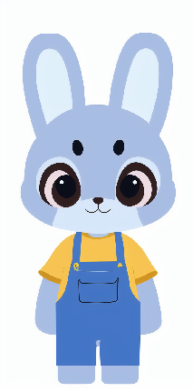

# Dancing Bunny Animation Project (舞蹈小兔动画项目)

## Project Description (项目描述)

This project creates an animated music video featuring a character called Max, who dances in sync with a provided song. The animation process uses a custom skeleton and pivot system, where each part of Max's body is cut from a PNG image and animated with rotation to simulate movements. The main challenge lies in building an animation system from scratch, using only a single PNG image, to create smooth, visually consistent animations.  
该项目创建了一个动画音乐视频，特色是一个名为 Max 的角色，他随着提供的歌曲同步跳舞。动画过程使用了自定义的骨骼和枢轴系统，其中 Max 的每个身体部位都是从 PNG 图像中裁剪出来的，并通过旋转来模拟运动。主要挑战在于从头开始构建一个动画系统，仅使用单一 PNG 图像来创建平滑、一致的动画效果。

### **Challenge Details (挑战详情)**
- **Song**: Provided by the company, with lyrics in the appendix.  
  **歌曲**: 由公司提供，歌词在附录中。
- **Character**: A PNG image of Max.  
  **角色**: Max 的 PNG 图像。
- **Visual Style**: The visual style should align with the design found in the app for reference (available for download from the link provided in the task).  
  **视觉风格**: 视觉风格应与应用程序中的设计保持一致（可从任务提供的链接下载）。
- **Consistency**: The background and character design need to be consistent throughout the animation.  
  **一致性**: 背景和角色设计需要在整个动画过程中保持一致。

---

## Approach (方法)

### **Approach 1: Using ControlNet and Stable Diffusion (方法1: 使用ControlNet和稳定扩散)**

The first approach attempted to use ControlNet in combination with Stable Diffusion to generate images of Max performing different actions. The idea was to generate multiple images of Max that align with the song’s tempo and rhythm. However, this approach faced significant challenges:  
第一种方法尝试结合使用 ControlNet 和稳定扩散生成 Max 执行不同动作的图像。目标是生成多张 Max 的图像，这些图像与歌曲的节奏和旋律对齐。

I used ControlNet in the img2img tab, and in the ControlNet panel, I followed these settings:

Enable: Checked the "Enable" box.
Preprocessor: Set to "inpaint_only".
Control Weight: Set to 1.0.
Denoising Strength: Started with 0.45.
Sampling Steps: Set to 20-30.
Sampling Method: Chose Euler a.

然而，这种方法面临了挑战：

- **Inconsistent Results**: The generated images of Max did not maintain the same visual design across frames.  
  生成的 Max 图像在不同帧之间未能保持相同的视觉设计。
- **Lack of Consistency**: The background and character design were inconsistent, making it unsuitable for a smooth animation flow.  
  背景和角色设计不一致，这使得其不适合平滑的动画过渡。



Despite promising potential, this approach was abandoned due to its inability to create a coherent animation for Max.  
尽管这一方法具有一定潜力，但由于无法为 Max 创建连贯的动画，因此最终放弃了此方法。

### **Approach 2: Custom Skeleton System and AI-Generated Movesets (方法2: 自定义骨骼系统与AI生成的动作集)**

The second approach, which is the current working solution, revolves around building a custom animation system from scratch. Key steps involved:  
第二种方法是当前有效的解决方案，它围绕从头开始构建一个自定义动画系统展开。关键步骤包括：

1. **Skeleton System**: A skeleton system was created to rotate each body part of Max around a pivot point. Each body part was cut from the original PNG image, and adjustments were made to allow for smooth, dynamic movements.  
   **骨骼系统**: 创建了一个骨骼系统，使 Max 的每个身体部位围绕枢轴点旋转。每个身体部位都是从原始 PNG 图像中裁剪出来的，并做出调整，以便进行平滑且动态的运动。
   
2. **Animation System**: Using Pygame, a custom animation system was created to control the rotations and movements of Max’s body parts in a 2D space. This system allows Max to perform a range of actions like jumping, walking, and waving.  
   **动画系统**: 使用 Pygame 创建了一个自定义动画系统，用于控制 Max 身体部位在 2D 空间中的旋转和运动。这个系统允许 Max 执行一系列动作，如跳跃、行走和挥手。

3. **JSON-based Control**: An animation system was developed to control Max’s movements using a JSON file. This system can be passed various movement configurations (e.g., jump, walk) to animate Max accordingly.  
   **基于 JSON 的控制**: 开发了一个动画系统，通过 JSON 文件控制 Max 的动作。这个系统可以传递各种运动配置（例如跳跃、行走）来动画化 Max。

4. **AI Agent**: The music analysis and move generation were fully automated through an AI agent. The agent analyzes the music to generate synchronized movements, ensuring that Max’s actions align with the tempo and energy of the song.  
   **AI 智能體**: 音乐分析和动作生成完全通过 AI 代理自动化。代理分析音乐并生成同步动作，确保 Max 的动作与歌曲的节奏和能量对齐。

This approach ensures a consistent animation style and allows for smooth, synchronized movements while maintaining the integrity of Max's design.  
这种方法确保了动画风格的一致性，并允许平滑、同步的动作，同时保持 Max 设计的完整性。

---

## Assumptions (假设)

- **Max’s Body as a PNG**: The character Max starts as a flat PNG image, rather than a PSD file with individual layers. This means that body parts cannot be directly manipulated as independent layers, so a skeleton system and pivot points were implemented to create movement.  
  **Max 的身体作为 PNG 图像**: 角色 Max 从一个平面的 PNG 图像开始，而不是拥有独立图层的 PSD 文件。这意味着身体部位不能像独立图层一样直接操作，因此实现了骨骼系统和枢轴点来创建运动。

- **Custom Skeleton and Pivot System**: Since the provided character is a flat PNG, the animation system had to be built from scratch, creating a skeleton and defining pivot points for different body parts. Each body part (head, arms, legs) was manually cut, modified, and adjusted for smooth animation.  
  **自定义骨骼和枢轴系统**: 由于提供的角色是一个平面的 PNG 图像，动画系统必须从头开始构建，创建骨骼并为不同的身体部位定义枢轴点。每个身体部位（头部、手臂、腿部）都经过手动裁剪、修改和调整，以确保动画平滑。

- **Movement Simulation with Pivot Points**: To simulate complex movements like jumping and walking, a pivot system was created to allow for rotation of body parts around predefined points. This method enables realistic actions, such as arm and leg movements, while ensuring Max’s body remains in proportion.  
  **通过枢轴点模拟运动**: 为了模拟跳跃和行走等复杂动作，创建了一个枢轴系统，允许身体部位围绕预定义的点旋转。此方法实现了现实的动作，如手臂和腿部运动，同时确保 Max 的身体保持比例。

---

## Process (过程)

### **Step 1: Preparing Max’s PNG and Building the Skeleton System (步骤1：准备Max的PNG并构建骨骼系统)**  
The first step was to prepare Max’s body parts for animation. I manually cut Max’s body parts (head, arms, legs) from the PNG image and placed them into a skeleton system that allows for smooth rotation:  
第一步是为 Max 准备身体部件进行动画。我手动从 PNG 图像中裁剪出 Max 的身体部件（头部、手臂、腿部），并将其放入一个骨骼系统中，使其能够平滑旋转：

- **Cutting and Adjusting the Body Parts**: Max’s body parts were cut and adjusted to allow flexibility for rotations during animation.  
  **切割和调整身体部件**: Max 的身体部件被裁剪并调整，以便在动画过程中具有旋转的灵活性。
- **Building the Skeleton System**: The pivot points for each body part were defined to allow for rotation. This system ensures that Max’s body moves in a realistic and proportional manner.  
  **构建骨骼系统**: 为每个身体部位定义了枢轴点，以便进行旋转。这个系统确保 Max 的身体以现实和比例的方式移动。

### **Step 2: Building the Custom Animation System (步骤2：构建自定义动画系统)**  
With the skeleton system in place, I created the custom animation system using **Pygame**. This system controls Max’s body parts based on predefined movement sequences:  
在骨骼系统完成后，我使用 **Pygame** 创建了自定义动画系统。这个系统根据预定义的动作序列控制 Max 的身体部位：

- **Animating Movements**: The system allows Max’s arms, legs, and head to rotate in accordance with predefined sequences (e.g., jumping, walking).  
  **动画运动**: 系统允许 Max 的手臂、腿和头部根据预定义的动作序列（例如跳跃、行走）旋转。
- **Custom Pivot System**: Each body part rotates around its defined pivot, simulating realistic movement such as walking and jumping.  
  **自定义枢轴系统**: 每个身体部位围绕定义的枢轴旋转，模拟现实的运动，如行走和跳跃。
- **Sequencing**: The animation system allows for smooth transitions between movements, ensuring Max’s actions flow logically.  
  **序列化**: 动画系统允许动作之间的平滑过渡，确保 Max 的动作逻辑流畅。

### **Step 3: Automating Movement Creation with the AI Agent (步骤3：通过AI代理自动生成动作)**  
I created an **AI agent** to automate the analysis of the music and the creation of movement sequences:  
我创建了一个 **AI 代理** 来自动分析音乐并生成动作序列：

- **Music Analysis**: The agent analyzes the tempo and energy of the song, identifying key musical moments where Max should perform actions like jumping, waving, or walking.  
  **音乐分析**: 代理分析歌曲的节奏和能量，识别 Max 应该执行跳跃、挥手或行走等动作的关键时刻。
- **Generating Movesets**: Based on the analysis, the AI generates movement sequences that match the song's tempo and energy, creating synchronized animations.  
  **生成动作集**: 基于分析，AI 生成与歌曲节奏和能量匹配的动作序列，创建同步的动画。

### **Step 4: Generating and Synchronizing the Final Animation (步骤4：生成并同步最终动画)**  
Once the movesets were generated, the final animation was created by combining the movement sequences:  
一旦生成了动作集，最终动画便通过组合这些动作序列来创建：

- **Frame-by-Frame Animation**: Each movement sequence was broken down into frames, ensuring that Max's movements are smooth and fluid.  
  **逐帧动画**: 每个动作序列都被分解为帧，确保 Max 的动作平滑流畅。
- **Recording and Saving the Video**: The frames were recorded and saved as an `.mp4` file using OpenCV, with Max’s movements perfectly synchronized to the music.  
  **录制和保存视频**: 使用 OpenCV 录制并将这些帧保存为 `.mp4` 文件，Max 的动作与音乐完美同步。

---

## Areas for Improvement (待改进的地方)

Despite the overall success of the project, there were a few aspects that did not work as expected or could be improved:

1. **AI Agent's Music Analysis**: The music characteristic extraction by the AI agent was not accurate from the start. The lack of deep music knowledge in the agent made it difficult to generate well-synchronized movements. Future improvements could include refining the music analysis to better capture musical nuances and improve synchronization with the animation.  
   **AI代理的音乐分析**：AI代理在提取音乐特征时并不准确，缺乏足够的音乐知识使得生成的动作与音乐节奏同步性差。未来可以通过改进音乐分析，捕捉更多的音乐细节，提高同步性。

2. **Moveset Speed**: The generated movesets might be too fast for children to react to and follow. Adjustments to movement speeds would be needed to make the animation more child-friendly.  
   **动作集的速度**：生成的动作集可能对儿童来说过于快速，难以跟随。需要调整动作的速度，使动画更加适合儿童。

3. **Limited Action Set Due to Pivot System**: The current pivot system, while effective, restricts the variety of possible actions. Some more dynamic movements are harder to execute, and the animation feels limited in scope. Future iterations might include a more advanced system that offers greater flexibility in movement.  
   **由于骨骼系统限制的动作集**：当前的骨骼系统虽然有效，但限制了可能的动作种类。某些更具动感的动作难以实现，导致动画的表现力受到限制。未来可以考虑引入更先进的系统，以提高动作的灵活性。

4. **Time Constraints**: The project was completed within a tight timeframe (two days), which meant that certain aspects were rushed or not fully optimized. There’s still room for improvement in terms of animation smoothness, variety of movements, and other technical refinements.  
   **时间限制**：由于项目在两天内完成，某些部分存在匆忙或未完全优化的情况。动画的流畅性、动作的多样性以及其他技术细节仍有提升空间。

---

## Components (组件)

### **1. Skeleton System (骨骼系统)**:
- The skeleton system allows for rotating body parts based on pivot points, simulating realistic movements. Each part of Max’s body (head, arms, legs) is separated and manipulated for animation.

### **2. Animation Manager (动画管理器)**:
- The animation manager controls the playback of movement sequences, handles timing, and ensures movements are synchronized with the music.

### **3. Audio Analysis (音频分析)**:
- **Librosa**: Used to extract the tempo, energy, and beats from the song, which are essential for synchronizing Max's movements.

### **4. AI Agent**:
- The AI agent analyzes the music’s tempo and energy, then generates corresponding movesets (e.g., jumping, waving) to animate Max in sync with the song.

### **5. Video Recording (视频录制)**:
- **OpenCV**: Captures each frame of the animation and saves the video as an `.mp4` file.

### **6. Music Playback (音乐播放)**:
- **Pygame**: Plays the background music while the animation runs.

---

## How to Run (如何运行)

### **1. Prerequisites (前提条件)**:
Ensure you have Python 3.x installed and the required libraries:

```bash
pip install pygame opencv-python librosa numpy langchain langchain_openai langchain_core langgraph pydantic
```

### **2. Setup (设置)**:
- Place the song file (e.g., `Dancing_D.wav`) in the `assets` folder as well.
- Adjust any constants in the `config.py` file (e.g., `WINDOW_WIDTH`, `FPS`, `OUTPUT_FILE`) as needed.

### **3. Running the Project (运行项目)**:
To run the project, execute the `main.py` file:
```bash
python main.py
```

Press **space** to start the animation and music playback. The video will be saved as an `.mp4` file in the `output` directory.
